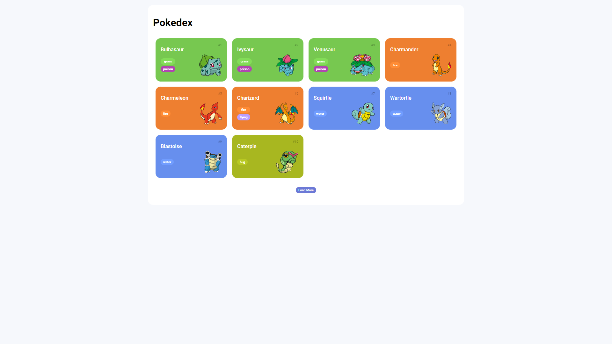
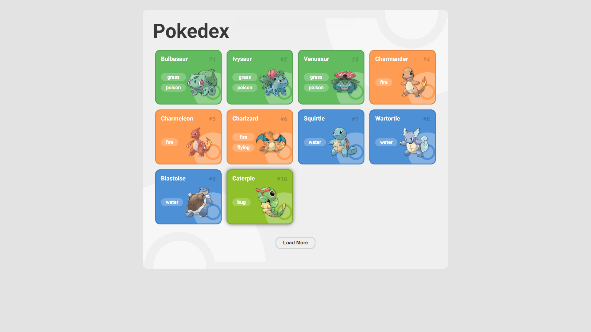
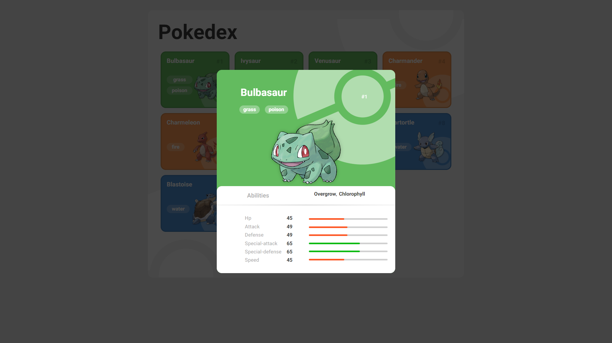

# Santander Bootcamp 2023 - Fullstack Java+Angular - Pokedex

 Foi desenvolvido nesse modulo "Primeiras Páginas Interativas com JavaScript", uma Pokedex utilizando a API [POKÉ.API](https://pokeapi.co), ministrado pelos(as) professores(as) 
 [Lucas Vilaboim](https://www.linkedin.com/in/vilaboim/),
 [Diana Martine](https://www.linkedin.com/in/dianamartine/),
 [Renan Johannsen](https://www.linkedin.com/in/renanjpaula/), pela plataforma
 [Digital Innovation One](https://www.dio.me/en). 
 
 **Desenvolvido com:** 

## Sobre o projeto
Este projeto é baseado em uma Pokedex, que mostra todos os Pokemons da primeira geração. A requisição é feita através da fetch API, utilizando a API pokeapi.co.

## Sobre o desafio
Basedo no [repositório ](https://github.com/digitalinnovationone/js-developer-pokedex) disponibilizado pelo professor [Renan Johannsen](https://www.linkedin.com/in/renanjpaula/), o desafio proposto consiste no desenvolvimento de uma nova janela onde é apresendado maiores detalhes do pokemon selecionado.

* **Para isso, foi necessário:**

    * Importar novas imagens para os pokemons.
    * Atualizar a estilização da página, trazendo uma nova identidade visual para a aplicação.
    * Desenvolver um modal que apresenta os detalhes do pokemon selecionado.
    * Desenvolver uma função que faz a requisição dos detalhes do pokemon selecionado.

 

